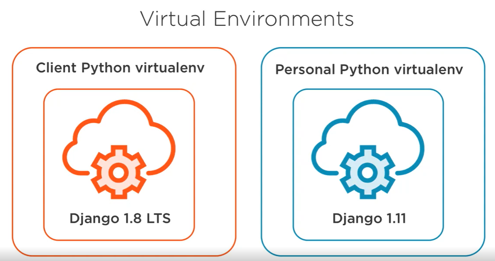

pip install virtualenv

virtualenv nextgenclass

virtualenv officeproject

activation:
Linux - source D:\Institute\workspace\nextgenclass\Scripts\activate.bat
Win: D:\Institute\workspace\nextgenclass\Scripts\activate.bat

deactivate

#variables
| Type             | Where It's Defined          | Scope                  | Shared? |
|------------------|-----------------------------|------------------------|---------|
| File Variable    | Top-level (outside class)   | Entire file/module     | Yes     |
| Class Variable   | Inside class, outside method| Class & all instances  | Yes     |
| Method Variable  | Inside a method             | Only inside that method| No      |
| Instance Variable| `self.var` inside method    | Specific to each object| No (unique) |
